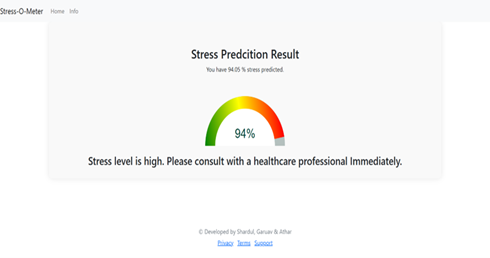
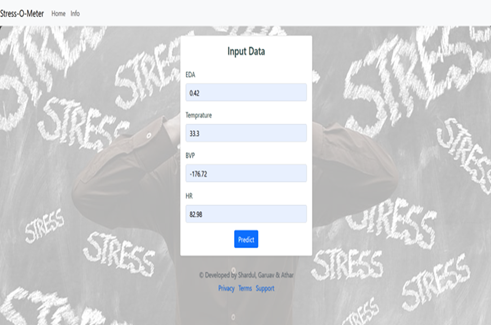
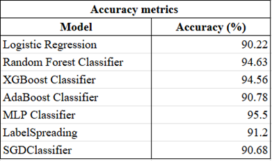

# Project: Stress Prediction Using Machine Learning!
The main goal of this project is to develop a reliable and efficient machine learning model that can accurately classify Stress level from medical features.





## Importance of the Project
- **Enhancing Healthcare**: By providing accurate and quick disease classification, this project aims to significantly improve patient care and diagnostic accuracy.
- **Research and Development**: It serves as a tool for researchers to analyze medical images more effectively, paving the way for new discoveries in the medical field.
- **Educational Value**: This project can be used as a learning platform for students and professionals interested in deep learning and medical image analysis.

## Technical Overview
- **Machine Learning Frameworks**: Utilizes popular frameworks like Sklearn or Kmeans for building and training the classification models.
- **Deep Learning Frameworks**: Utilizes popular frameworks like TensorFlow or PyTorch for building and training the classification models.
- **Git Integration**: For source code management and version control, making the project easily maintainable and scalable.
- **MLOps Practices**: Incorporates best practices in machine learning operations to automate workflows, from data preparation to model deployment.
- **DagsHub Integration**: Facilitates collaboration, data and model versioning, experiment tracking, and more in a user-friendly platform.

## Features Consider:

1. TEMP.csv - Data from temperature sensor expressed degrees on the Celsius (°C) scale.

2. EDA.csv - Data from the electrodermal activity sensor expressed as microsiemens (μS).

3. BVP.csv - Data from photoplethysmograph.
4. HR.csv- Average heart rate extracted from the BVP signal.The first row is the initial time of the session expressed as unix timestamp in UTC.

# How to run?
### STEPS:

Clone the repository

```bash
https://github.com/serpentile-c137/Stress-Prediction
```

### STEP 01- install the requirements
```bash
pip install -r requirements.txt
```

### STEP 02- EDA
```bash
#run this file to visualizes the distribution of features

EDA_new_raw.ipynb in EDA branch
```
### STEP 03- Model Training
```bash
#run this file to generate the models

Run all the models.ipynb files present in Model_Train branch
```



Now run,
```bash
python app.py for frontend
```


# AWS-CICD-Deployment-with-Github-Actions

## 1. Login to AWS console.

## 2. Create IAM user for deployment

	#with specific access

	1. EC2 access : It is virtual machine

	2. ECR: Elastic Container registry to save your docker image in aws


	#Description: About the deployment

	1. Build docker image of the source code

	2. Push your docker image to ECR

	3. Launch Your EC2 

	4. Pull Your image from ECR in EC2

	5. Lauch your docker image in EC2

	#Policy:

	1. AmazonEC2ContainerRegistryFullAccess

	2. AmazonEC2FullAccess

	
## 3. Create ECR repo to store/save docker image
    - Save the URI: 566373416292.dkr.ecr.us-east-1.amazonaws.com/chicken

	
## 4. Create EC2 machine (Ubuntu) 

## 5. Open EC2 and Install docker in EC2 Machine:
	
	
	#optinal

	sudo apt-get update -y

	sudo apt-get upgrade
	
	#required

	curl -fsSL https://get.docker.com -o get-docker.sh

	sudo sh get-docker.sh

	sudo usermod -aG docker ubuntu

	newgrp docker
	
# 6. Configure EC2 as self-hosted runner:
    setting>actions>runner>new self hosted runner> choose os> then run command one by one


# 7. Setup github secrets:

    AWS_ACCESS_KEY_ID=

    AWS_SECRET_ACCESS_KEY=

    AWS_REGION = us-east-1

    AWS_ECR_LOGIN_URI = demo>>  566373416292.dkr.ecr.ap-south-1.amazonaws.com

    ECR_REPOSITORY_NAME = simple-app
